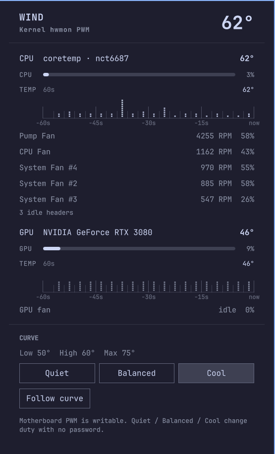

# WindCore

CPU and GPU temperatures, fan RPM, Quiet / Balanced / Cool presets, and
**Follow curve** continuous PWM for the Omarchy bar.

Made with [Cursor](https://cursor.com).

Plugin id (unchanged for upgrades): `io.github.anesturi.fan-control`



## Install

```sh
omarchy plugin add https://github.com/ANest58/omarchy-fan-control.git --enable
omarchy bar move io.github.anesturi.fan-control --section right
omarchy restart shell
```

On first install, open the panel and click **Allow passwordless control** if
motherboard PWM nodes are root-only (desktop PCs). Apple hardware may also need
`/etc/mbpfan.conf` — use **Install /etc/mbpfan.conf** in the panel or key `i`.

## Usage

| Action | How |
|--------|-----|
| Open / close panel | Click the bar pill |
| Force sensor refresh | Middle-click the pill |
| Quiet / Balanced / Cool | Keys `1` / `2` / `3` or preset buttons |
| Install system mbpfan config | Key `i` |
| Toggle follow curve | Key `f` or **Follow curve** button |
| Close panel | **Esc** |

The bar pill shows live CPU/GPU temps (e.g. `54° 61°`). The panel adds usage
bars, a 60-second temperature dot chart (sampled every **3 seconds**), fan RPM,
and curve controls.

### Presets vs Follow curve

| Mode | What it does | Best for |
|------|----------------|----------|
| **Presets** (`1`/`2`/`3`) | Saves a temp curve *and* sets a **fixed PWM duty** immediately | Quick “make it quiet / loud now” |
| **Follow curve** (`f`) | Background loop adjusts PWM **every 3 s** from the saved curve as CPU temp changes | Day-to-day desktop cooling |

Presets and follow are mutually exclusive: applying a preset **stops** follow mode.

### Follow curve — step by step

1. **Unlock PWM once** (desktop): panel → **Allow passwordless control**  
   Or: `python3 scripts/fanctl.py grant-access`

2. **Pick a starting curve** (optional): click **Balanced** or edit thresholds in  
   `~/.config/mbpfan/mbpfan.conf` (`low_temp`, `high_temp`, `max_temp`).

3. **Start follow**  
   - Panel: **Follow curve** (or key `f`)  
   - CLI:
     ```sh
     PLUGIN="$HOME/.config/omarchy/plugins/io.github.anesturi.fan-control"
     python3 "$PLUGIN/scripts/fanctl.py" follow start
     ```

4. **Confirm it is running**
   ```sh
   python3 "$PLUGIN/scripts/fanctl.py" follow status
   # or
   cat ~/.local/state/omarchy/fan-control/follow-state.json
   ```
   Example: `{"running": true, "temp": 54, "percent": 41, "skipped": false, ...}`  
   - `percent` — target fan duty from the curve  
   - `skipped: true` — hysteresis held the last duty (change &lt; 5%)

5. **Stop follow** (returns case fans to firmware auto mode)  
   - Panel: **Stop follow curve**  
   - CLI: `python3 "$PLUGIN/scripts/fanctl.py" follow stop`  
   - Systemd: `systemctl --user disable --now fan-control-follow.service`

`follow start` enables a user systemd unit when available
(`~/.config/systemd/user/fan-control-follow.service`); otherwise it spawns a
detached process. PWM index **2** (AIO pump on many MSI boards) is never driven.

### Curve reference (Balanced preset)

| Threshold | Fan duty |
|-----------|----------|
| ≤ `low_temp` (63°C) | 25% |
| `low_temp` → `high_temp` | 25% → 75% |
| `high_temp` → `max_temp` | 75% → 100% |
| ≥ `max_temp` (86°C) | 100% |

## Configure

```sh
omarchy bar move io.github.anesturi.fan-control --section right
```

Bar widget setting **`refreshSeconds`** (1–10, default 2) controls how often
the panel refreshes sensor JSON. Follow curve and the temp chart both use a
**3 second** interval independently.

Edit the saved curve:

```sh
${EDITOR:-nano} ~/.config/mbpfan/mbpfan.conf
```

## Dependencies and privileges

| Component | Purpose |
|-----------|---------|
| `python3` (stdlib) | Sensor collector and PWM helper (`scripts/fanctl.py`) |
| `lm_sensors` / hwmon | CPU temp and motherboard fan RPM on desktop PCs |
| `nvidia-smi` (optional) | NVIDIA GPU temperature and fan percent |
| `nvidia-settings` (optional) | NVIDIA fan RPM when Coolbits is enabled |
| `mbpfan` (optional) | Apple SMC fan daemon on Intel MacBooks |
| `t2fanrd` (optional) | T2 Mac fan daemon |
| `pkexec` / polkit | One-time install of `/etc/mbpfan.conf`, PWM unlock, udev rule |

Privileged writes go through `scripts/fanctl-privileged.py` via `pkexec` only
when you choose install, grant-access, or Apple curve apply. Follow curve never
prompts — it writes PWM as your user after that one-time unlock.

Bundled files installed on request:

- `udev/99-io.github.anesturi.fan-control.rules` — passwordless PWM after unlock
- `scripts/pwm-unlock.sh` — re-chmod PWM at boot and after resume
- `polkit/io.github.anesturi.fan-control.policy` — privileged helper actions
- `etc/mbpfan.conf` — default temperature curve for `mbpfan`

## Desktop motherboard fans (NCT6687)

`coretemp` reports CPU temperature only. Case and CPU header RPM come from a
Super I/O chip (for example NCT6687). Base setup:

```sh
sudo pacman -S lm_sensors
sudo sensors-detect
sudo systemctl enable --now lm_sensors.service
```

On MSI boards where stock `nct6683` ignores PWM writes, install
`nct6687d-dkms-git` from the AUR and blacklist `nct6683`.

| Preset   | Fixed duty | Temp curve (low / high / max °C) |
|----------|------------|-----------------------------------|
| Quiet    | 18%        | 70 / 78 / 90                      |
| Balanced | 45%        | 63 / 66 / 86                      |
| Cool     | 100%       | 50 / 60 / 75                      |

## MacBook / mbpfan

```sh
yay -S mbpfan-git
sudo cp etc/mbpfan.conf /etc/mbpfan.conf
sudo systemctl enable --now mbpfan
```

T2 Macs: use `t2fanrd` instead (`sudo systemctl enable --now t2fanrd`).

## Development

See **[DEV.md](DEV.md)** for a guided tour of the codebase.

Quick checks:

```sh
PLUGIN_DIR="$HOME/.config/omarchy/plugins/io.github.anesturi.fan-control"
omarchy plugin validate "$PLUGIN_DIR"
cd "$PLUGIN_DIR" && python3 tests/fanctl_test.py && node --test tests/model.test.js
omarchy-shell shell rescanPlugins   # after QML/Python edits
```

## Remove

```sh
omarchy plugin remove io.github.anesturi.fan-control --yes
```

Optional cleanup:

| What | How to remove |
|------|----------------|
| Follow service | `systemctl --user disable --now fan-control-follow.service` |
| Follow state | `rm -rf ~/.local/state/omarchy/fan-control/` |
| User curve copy | `rm -rf ~/.config/mbpfan/` |
| System mbpfan config | `sudo rm /etc/mbpfan.conf` |
| PWM udev rule | `sudo rm /etc/udev/rules.d/99-io.github.anesturi.fan-control.rules` |
| PWM boot/resume unlock | `sudo systemctl disable --now io.github.anesturi.fan-control-pwm.service; sudo rm -f /etc/systemd/system/io.github.anesturi.fan-control-pwm.service /usr/lib/systemd/system-sleep/io.github.anesturi.fan-control /usr/lib/io.github.anesturi.fan-control/pwm-unlock.sh` |
| Polkit policy | `sudo rm /usr/share/polkit-1/actions/io.github.anesturi.fan-control.policy` |

## Credits

WindCore was built with [Cursor](https://cursor.com).

| Project | Credit |
|---------|--------|
| [Cursor](https://cursor.com) | AI-assisted development of this plugin |
| [Omarchy](https://omarchy.org) | Linux desktop and bar this widget runs on ([source](https://github.com/basecamp/omarchy)) |
| [Quickshell](https://quickshell.org) | QML shell runtime used by Omarchy |
| [linux-on-mac/mbpfan](https://github.com/linux-on-mac/mbpfan) | Bundled `etc/mbpfan.conf` temperature defaults |
| Linux hwmon / [lm-sensors](https://github.com/lm-sensors/lm-sensors) | CPU temps and motherboard PWM sysfs |
| [nct6687d](https://github.com/Fred78290/nct6687d) | PWM writes on many MSI NCT6687 boards |
| [T2FanRD](https://github.com/GnomedDev/T2FanRD) | Optional T2 Mac fan daemon |
| NVIDIA `nvidia-smi` | Optional GPU temperature and fan percent |

## License

MIT. See [LICENSE](LICENSE). Third-party projects listed above keep their own licenses;
this plugin does not relicense them.
